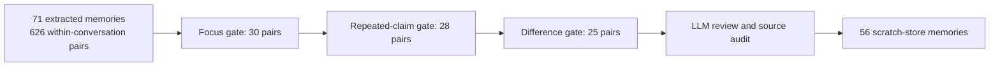

# Layered Jev save screening: four-conversation follow-up

**Result:** On 71 existing Titan memories from four real conversations, the layered screener sent 25 memory pairs to review versus 54 for a fresh single-pass Jev run. It removed all 25 *clear* false candidate pairs in this labeled sample, but found 21 of 27 known duplicate pair relationships versus 23 of 27 for single pass. After source review, the layered path saved 56 memories and the single-pass path saved 54. The stack made review cleaner while leaving two more redundant memories in storage.

This follows the [18-memory NASA test](jev-layered-small-experiment.md), where layering did not change the five review pairs or the final 16-memory result. Neither sample is held out. The four conversations and labels were inspected in the earlier Jev/Laya experiment. One five-member duplicate group accounts for ten of the 27 positive pair relationships, so these are not independent observations or a reliable accuracy estimate.

## What ran

The prototype took frozen outputs of the existing Titan save extraction, before any deduplication. Each conversation was kept separate. A configured DeepSeek v4 Flash call represented each memory independently as a subject, claims, and details. Jev then screened **every within-conversation pair** in three gates: same specific focus, repeated claim, and compatible differences. An explicit negative ended that pair's route; an uncertain answer continued. The original memory text was authoritative. All candidate pairs went to a configured DeepSeek reviewer, and a primary source audit approved, narrowed, or rejected proposed groups before embedding and saving into isolated SQLite stores. Jev never authorized a merge.

The baseline used the same 71 memories, a single Jev decision for all 626 pairs, the same reviewer instructions, and the same source audit and scratch-save mechanism. Prompts, routing rules, frozen labels, and baseline inputs were set before running the models. No production save path or live memory database was changed.

| Measurement across four conversations | Single pass | Layered |
|---|---:|---:|
| Pairs sent to review | 54 | 25 |
| Known duplicate relationships found | 23/27 | 21/27 |
| Clear false suggestions | 25 | 0 |
| Ambiguous suggestions | 6 | 4 |
| Memories after audited save, from 71 | 54 | 56 |
| Jev screening time, summed | 61.21 s | 76.62 s |
| Extra claim-preparation time | 0 | 78.57 s |
| Successful LLM review time, summed | 189.97 s across 3/4 batches | 110.30 s across 4/4 batches |
| Reported preparation + successful review tokens | 30,806, incomplete | 56,127 |

The baseline review timed out once on batch 0, then succeeded unchanged on retry. On batch 2, its nine-memory review packet timed out three times on the same model, prompt, and input: approximately 120, 120, and 240 seconds. I source-reviewed that packet directly as an explicit **manual fallback**. The 54-memory baseline final count includes that decision; its LLM review time and token total omit the failed requests and manual review. Failed requests took another 602.34 seconds across both batches; their token usage and billing are unknown. The figures therefore do not establish that layering saves time or money. The layered path also adds an LLM preparation call, which cannot be treated as free. Embedding counts include missing baseline vectors repaired during scratch save, so they do not measure production embedding savings.

The focus gate did most of the filtering: 626 → 30 pairs, while keeping 22 of 27 known positive pair relationships. The overlap gate kept those 22, then the difference gate removed one positive along with two other candidates. Compared with single pass, the final layered queue lost three known positive relationships and gained one, a net loss of two. For example, it missed a repeated circular-import request and a repeated skill-installation request. It did identify an installation detail that single pass missed. Those misses are why a cleaner queue cannot by itself establish a better save outcome.

The reviewer still needs oversight. In the larger sample it proposed merging an earlier plan with a later completion statement, and merging a broad task with a distinct investigation requirement. The primary source audit kept those facts separate. The approved merges preserved the represented original facts, original source IDs, both sides of conversation provenance, and singleton text and vectors. This supports the **reviewed** prototype's safety on these examples; it does not show that the automated reviewer alone can safely write memories.

Each of the eight saved stores was reopened and checked against its reviewed groups for row count, text, 768-dimensional vectors, source events, and user/assistant provenance. All original indices appear once in each outcome; frozen inputs and every stage route were checked; live-store fingerprints remained unchanged. The five focused packet and merge-boundary tests passed. Artifacts, including all Jev answers, prepared claims, reviewer outputs, timeouts, audits, and the aggregate `comparison.json`, are in ignored `.bench/jev-layered-expanded/`.

This is a promising **review-load** result, not a case for deploying the three-gate stack yet. The next prototype should concentrate on the first focus decision, which produced nearly all of the queue reduction and most of the lost duplicates. The later gates and extra LLM preparation need evidence that they recover enough reviewer effort to justify their time and missed pairs. A production decision also needs fresh conversations and automatic-review safety checks with no human adjudication.
