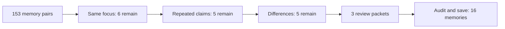

# Layered Jev prototype: original NASA sample

**The layered stack did not improve duplicate screening on this sample.** It returned exactly the same five candidate pairs as a fresh single-pass Jev run, including all three known duplicate relationships and two false matches. Both final, audited stores contain 16 memories, down from 18.

The implemented prototype uses a configured DeepSeek v4 Flash call to represent each memory independently as subject, claims and details. Jev then checks focus, overlap and meaningful differences. Uncertain answers continue; explicit negatives stop. Candidate links form review packets, not automatic merge groups. A separate configured LLM call reviews each variant's packets, followed by an orchestrator factual/scope audit before embedding and saving.

Prompts, rules and labels were frozen before the calls. Original texts remain authoritative. This is a previously inspected development sample, not a held-out benchmark.

| Measurement | Fresh single pass | Layered |
|---|---:|---:|
| Known positive pair relationships found | 3/3 | 3/3 |
| False candidate pairs | 2 | 2 |
| Review pairs / unique memories | 5 / 7 | 5 / 7 |
| Jev calls / pair decisions | 11 / 153 | 13 / 164 |
| Jev screening | 14.45 s | 18.25 s |
| Claim preparation | None | 62.65 s |
| LLM review | 49.29 s | 24.53 s |
| Sum of component times, excluding save and human audit | 63.74 s | 105.44 s |
| Reported preparation + review LLM tokens | 12,855 | 13,653 |
| Raw reviewer proposal count | 16 records | 14 records |
| Final count after scope audit | 16 | 16 |

The original historical single-pass run returned seven candidates; this fresh run returned five. These are single trials, so timing and output variation cannot be treated as stable performance estimates. LLM token totals include provider-reported completion/reasoning tokens and exclude Jev usage. The historical extraction cost is common to both variants and was not rerun. Preparation is explicitly charged to the layered prototype; it was not folded into production extraction for free.

The overlap layer rejected an editorial-forecast versus user-instruction pair that survived the focus layer. The final differences layer removed nothing: it labeled all five remaining pairs compatible extra details. Both editorial-change versus forecast pairs survived despite being outside our predeclared conservative duplicate definition. Additional layers repeated those mistaken judgments.

The two LLM review calls received identical candidate pair sets but different screening annotations. The plain reviewer approved only the clear [0,5,9] duplicate group. The layered reviewer also proposed consolidating [1,12] and [2,6], editorial updates with forecast/event facts. Those proposals retained their information, but they were broader consolidation rather than additional clear duplicate removal under the frozen definition. The final audit rejected them. They are preserved in raw outputs; the apparent 18-to-14 reduction is not reported as a deduplication gain. Nondeterminism and annotation influence cannot be separated by this one trial.

Verified: all stage routes and frozen hashes; all original indices represented exactly once; all 15 singleton texts and vectors unchanged; the approved event merge retains crew identities, six-day timing, record/year, measured distance/time and source URL. Both results were embedded as needed and saved to independent SQLite stores, with text/vector/event/provenance readback checks. All live stores retained their fingerprints. Five focused packet/merge-boundary tests pass; the script compiles. No production integration.

Implementation: `tools/benchmarks/jev_layered_probe.py`; safety tests: `tools/benchmarks/test_jev_layered_probe.py`. Ignored artifacts are in `.bench/jev-layered-small/`, including frozen manifests, prepared claims, every layer's answers, review inputs/raw outputs, scope audit, final stores and `comparison.json`.

The unchanged stack was subsequently run on the [larger four-conversation sample](jev-layered-expanded-experiment.md). This small test alone shows added overhead without added filtering benefit.
